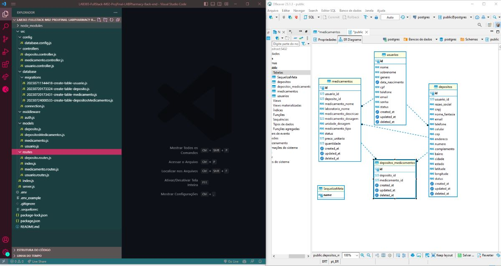
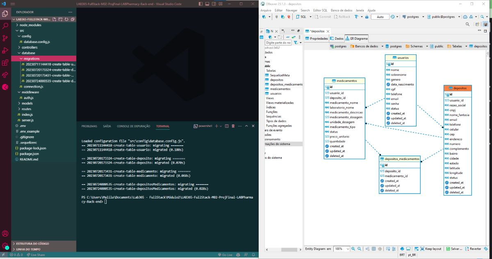
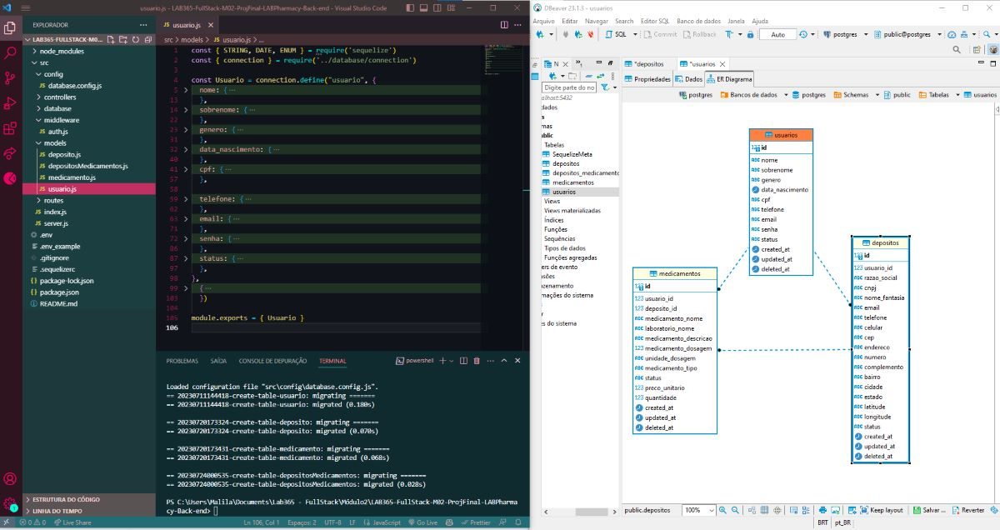
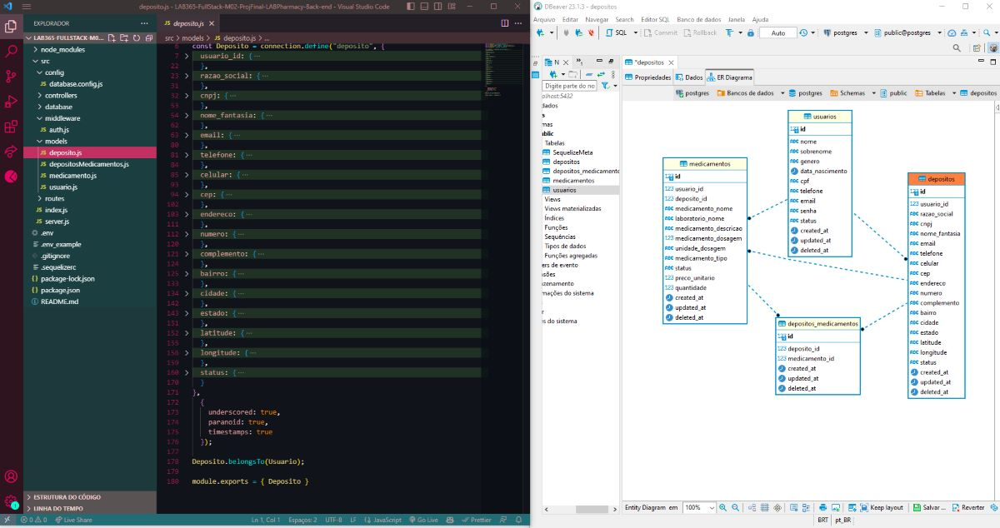
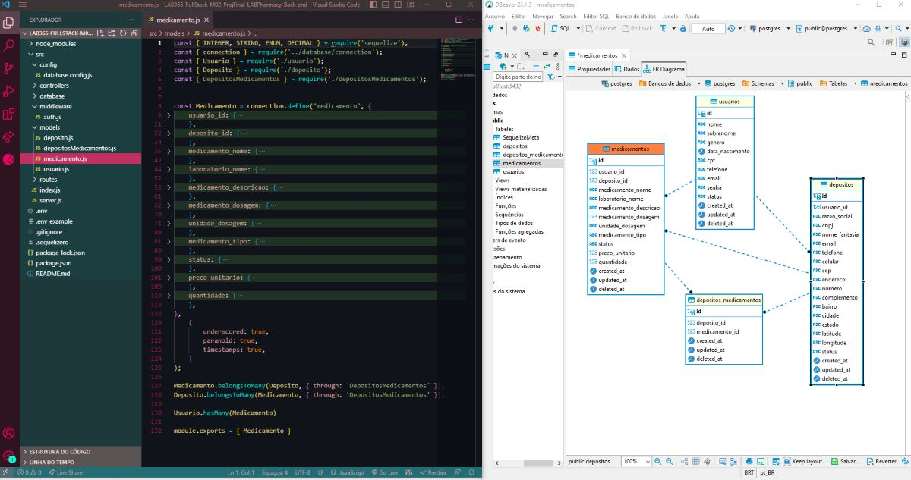

# LAB365-FullStack-M02-ProjFinal-LABPharmacy-Back-end

## Projeto Avaliativo do Módulo2
### LAB365- FullStack - Itaguaçu

#### Criação de sistema de gerenciamento de Depósitos e Medicamentos com Node.JS, Express.JS, Sequelize em Banco de Dados PostgreSQL
#### Nome do sistema: Pharmacy Central System 

### 🔗 Links

[](https://github.com/ricardo-werner)

[](https://www.linkedin.com/in/ricardo-werner)


Status - Concluído

### Demonstração

Estrutura geral do back end do Pharmacy Central System
<p align="center">
  
</p>

Estrutura geral do back end das Tabelas
<p align="center">
  
</p>

Estrutura geral do back end dos Usuários
<p align="center">
  
</p>

Estrutura geral do back end dos Depósitos
<p align="center">
  
</p>
Estrutura geral do back end dos Medicamentos
<p align="center">
  
</p>


### O Desafio
Neste projeto foi proposto criar um Back-end, em Node.JS, Express.JS, Sequelize em Banco de Dados PostgreSQL, para gerenciamento de depósitos e medicamentos em complemento ao projeto do módulo01 - LABPharmacy Inc.

### Requisitos da Aplicação

| Item  | Descrição                                            
| ----- | ---------------------------------------------------------------------------- |
|  1    |  Ser uma API Rest desenvolvida em Node.JS com uso do Express.js.                |
|  2    |  Utilizar o banco de dados PostgreSQL.                                       |
|  3    |  Ser planejado utilizando o modelo Kanban na ferramenta Trello.              |
|  4    |  Ser versionado no GITHub, possuindo uma documentação detalhada no readme.md.|
|  5    |  Deverá ser gravado um vídeo de apreentação do sistema.                      |

### Formato do Sistema

| Item                   | Descrição                                            
| --------------------------------------------- | ----------------------------------------------------------------------------------------------------- |
|  Carregamento de Dados Iniciais               |  Deve ser utilizado como Sistema Gerenciador de BD o PostgreSQL (nome: pcsbd)                         |
|  Cadastro de Usuário                          |  Serviço de cadastro de usuário com dados completos, definição de Endpoint com status                 |
|  Login do Usuário                             |  Serviço para realizar o login, definição de Endpoint com status                                      |
|  Atualização dos Dados de Usuário             |  Serviço para alterar/atualizar os dados do usuário, definição de Endpoint com status                 |        
|  Atualização do Status do Usuário no Sistema  |  Serviço para alterar/atualizar o status do usuário, definição de Endpoint com status                 |
|  Atualização de Senha do Usuário              |  Serviço para alterar/atualizar a senha de determinado usuário, definição do Endpoint com status      |
|  Listagem de Usuário pelo indentificador      |  Serviço de consulta de usuário pelo ID, definição de Endpoint com status                             |
|  Cadastro de Despósito                        |  Serviço de cadastro de DEpósito com dados completos, definição de Endpoint com status                |
|  Atualização dos dados de Despósito           |  Serviço para alterar/atualizar os dados de determinado depósito , definção de Endpoint com status    |
|  Atualização do Status do Depósito no Sistema |  Serviço apra alterar/atualizar o status do depósito no sistema, definição de Endpoint com status     |
|  Listagem de Depósitos                        |  Serviço de listagem de depósitos cadastrados, definição do Endpoint com status                       |
|  Listagem de Depósito pelo identificador      |  Serviço de consulta de depósito pelo ID, definição de Endpoint com status                            |
|  Exclusão de Depósitos                        |  Serviço para excluir um depósito pelo ID, definição de Endpoint com status                           |
|  Cadastro de Medicamentos                     |  Serviço de cadastro de Medicamentos com dados completos, definição de Endpoint com status            |
|  Atualização dos dados de Medicamentos        |  Serviço para alterar/atualizar os dados de determinado medicamento, definição de Endpoint com status |
|  Listagem de Medicamentos                     |  Serviço de listagem de medicamentos cadastrados, definição de Endpoint com status                    |
|  Listagem de Medicamentos pelo indentificador |  Serviço de listagem de medicamentos pelo ID, definição de Endpoint com status                        |
|  Exclusão de Medicamento                      |  Serviço para excluir um medicamento pelo ID, definição de Endpoint com status                        |

### Plano do Projeto

No desenvolvimento desta aplicação, colocamos em prática:

| Item  | Descrição                                            
| ----- | ------------- |
|  1    |  Node.JS      |
|  2    |  Express.JS   |
|  3    |  Sequelize    |
|  4    |  Skills       |

### Tecnologias utilizadas:

- Visual Studio Code
- Trello
- Node.JS

Por ainda ser uma estrutura nova para mim, o projeto de backend "Criação de gerenciamento de Depósitos e Medicamentos" com Node.JS, Express.JS e Sequelize em banco d dados PostgreSQL, proporcionou uma experiência enriquecedora no desenvolvimento de estruturas de migrations, models, routes e controllers, onde foi possível compreender as estruturas de exportação e importação dos componentes e pensar em como estruturar uma aplicação de forma à facilitar as futuras manutenções.

### Nota - Para que o sistema funcione corretamente, primeiramente é necessário ter instalado no seu computador:
- Node.JS
- Node Package Manager(NPM)
- PostgreSQL (Base de dados)
- DBeaver (Gerenciador de banco de dados)

## Para utilizar este projeto como base, faça o seguinte passo-a-passo:

Clone o projeto para a sua máquina
```bash
git@github.com:ricardo-werner/LAB365-FullStack-M02-ProjFinal-LABPharmacy-Back-end.git
```
Obs: necessário configurar SSH [(veja como clicando aqui)](https://www.youtube.com/watch?v=n-H1eFSsugo)

Instale as dependências.
```bash
npm install
```

- Rode o projeto
```bash
npm run start:dev
```

## Autor

Ricardo Werner - 
Dev FullStack em desenvolvimento - 
LAB365-FullStack-Itaguaçu
